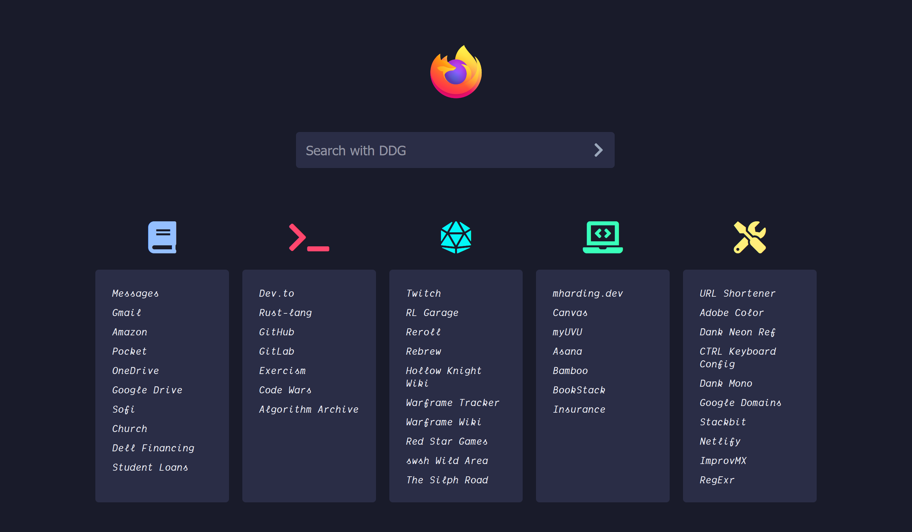

# DankFox for Firefox

FireFox userChrome & Custom Start Page

My custom new tab page modified from [PixelFox](https://github.com/AnubisZ9/PixelFox) and some userChrome borrowed from [MaterialFox](https://github.com/muckSponge/MaterialFox) to get some nice right-click menus and bookmark dropdowns.

I designed the colors of the startpage to match the [Dank Neon Firefox theme](https://addons.mozilla.org/en-US/firefox/addon/dank-neon/) I created based on the [Dank Neon editor theme](https://dankneon.com/), so it probably works best with that theme added by default.



### How to get the custom new tab page working

In order to make the custom new tab page work, the following instrucions must be followed:

- Create and place `autoconfig.cfg` in Firefox main install folder. In this cfg file you must set your local homepage (`var newTabURL ="path_to_local_html_file"`).

- Create and place `autoconfig.js` in a subfolder of Firefox main install folder > defaults > pref

**autoconfig.cfg**
```
// first line is a comment
var {classes:Cc,interfaces:Ci,utils:Cu} = Components;
var newTabURL = "path_to_local_html_file";
aboutNewTabService = Cc["@mozilla.org/browser/aboutnewtab-service;1"].getService(Ci.nsIAboutNewTabService);
aboutNewTabService.newTabURL = newTabURL;
```

**autoconfig.js**
```js
//
pref("general.config.filename", "autoconfig.cfg");
pref("general.config.obscure_value", 0);
pref("general.config.sandbox_enabled", false);
```
